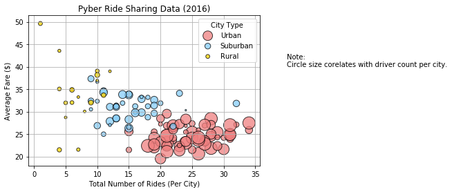
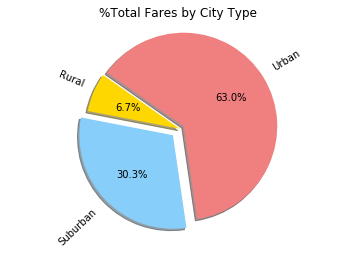
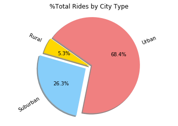
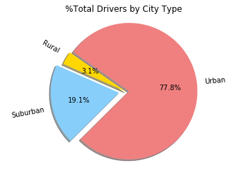

# <h1>Pyber Solution</h1>
<div>

<table style="width:100%" align="right" border="1">
    <caption>These are the observable trends</caption>
    <tr><th>Serial #</th><th>Observation</th></tr>
    <tr><td>1</td><td>The number of drivers and rides are <b>overwhelmingly ( >60% )</b> urban.</td></tr>
    <tr><td>2</td><td>The mean fare per ride is lowest in urban areas and highest in rural areas.</td></tr>
    <tr><td>3</td><td>The <u>revenue per driver</u> for rural drivers is much higher <b>( >2.5 times ) </b> that of urban drivers.</td></tr>
</table>
</div>


```python
##Import the required libraries
import pandas as pd
import numpy as np
import matplotlib.pyplot as plt
```


```python
##Create a path to the data files
ride_csv_path = "Resources/ride_data.csv"
city_csv_path = "Resources/city_data.csv"
```


```python
##Read and verify the ride data
ride_df = pd.read_csv(ride_csv_path)
ride_df.head()
```


<div>
<style>
    .dataframe thead tr:only-child th {
        text-align: right;
    }

    .dataframe thead th {
        text-align: left;
    }

    .dataframe tbody tr th {
        vertical-align: top;
    }
</style>
<table border="1" class="dataframe">
  <thead>
    <tr style="text-align: right;">
      <th></th>
      <th>city</th>
      <th>date</th>
      <th>fare</th>
      <th>ride_id</th>
    </tr>
  </thead>
  <tbody>
    <tr>
      <th>0</th>
      <td>Sarabury</td>
      <td>2016-01-16 13:49:27</td>
      <td>38.35</td>
      <td>5403689035038</td>
    </tr>
    <tr>
      <th>1</th>
      <td>South Roy</td>
      <td>2016-01-02 18:42:34</td>
      <td>17.49</td>
      <td>4036272335942</td>
    </tr>
    <tr>
      <th>2</th>
      <td>Wiseborough</td>
      <td>2016-01-21 17:35:29</td>
      <td>44.18</td>
      <td>3645042422587</td>
    </tr>
    <tr>
      <th>3</th>
      <td>Spencertown</td>
      <td>2016-07-31 14:53:22</td>
      <td>6.87</td>
      <td>2242596575892</td>
    </tr>
    <tr>
      <th>4</th>
      <td>Nguyenbury</td>
      <td>2016-07-09 04:42:44</td>
      <td>6.28</td>
      <td>1543057793673</td>
    </tr>
  </tbody>
</table>
</div>


```python
##Read and verify the city data
city_df = pd.read_csv(city_csv_path)
city_df.head()
```


<div>
<style>
    .dataframe thead tr:only-child th {
        text-align: right;
    }

    .dataframe thead th {
        text-align: left;
    }

    .dataframe tbody tr th {
        vertical-align: top;
    }
</style>
<table border="1" class="dataframe">
  <thead>
    <tr style="text-align: right;">
      <th></th>
      <th>city</th>
      <th>driver_count</th>
      <th>type</th>
    </tr>
  </thead>
  <tbody>
    <tr>
      <th>0</th>
      <td>Kelseyland</td>
      <td>63</td>
      <td>Urban</td>
    </tr>
    <tr>
      <th>1</th>
      <td>Nguyenbury</td>
      <td>8</td>
      <td>Urban</td>
    </tr>
    <tr>
      <th>2</th>
      <td>East Douglas</td>
      <td>12</td>
      <td>Urban</td>
    </tr>
    <tr>
      <th>3</th>
      <td>West Dawnfurt</td>
      <td>34</td>
      <td>Urban</td>
    </tr>
    <tr>
      <th>4</th>
      <td>Rodriguezburgh</td>
      <td>52</td>
      <td>Urban</td>
    </tr>
  </tbody>
</table>
</div>


```python
##Create a dataframe with ride count per city
ride_df_groupedby_city = ride_df.groupby("city").count()
ride_count_by_city_df = pd.DataFrame(ride_df_groupedby_city)
ride_count_by_city_df.to_excel("ridegroupedbycity.xlsx")
ride_count_by_city_df["ride count"] = ride_count_by_city_df["date"]
ride_count_by_city_df.drop(axis=1,labels=["date","fare","ride_id"],inplace=True)
ride_count_by_city_df.head()
```


<div>
<style>
    .dataframe thead tr:only-child th {
        text-align: right;
    }

    .dataframe thead th {
        text-align: left;
    }

    .dataframe tbody tr th {
        vertical-align: top;
    }
</style>
<table border="1" class="dataframe">
  <thead>
    <tr style="text-align: right;">
      <th></th>
      <th>ride count</th>
    </tr>
    <tr>
      <th>city</th>
      <th></th>
    </tr>
  </thead>
  <tbody>
    <tr>
      <th>Alvarezhaven</th>
      <td>31</td>
    </tr>
    <tr>
      <th>Alyssaberg</th>
      <td>26</td>
    </tr>
    <tr>
      <th>Anitamouth</th>
      <td>9</td>
    </tr>
    <tr>
      <th>Antoniomouth</th>
      <td>22</td>
    </tr>
    <tr>
      <th>Aprilchester</th>
      <td>19</td>
    </tr>
  </tbody>
</table>
</div>


```python
##Create a dataframe with average fare per city
ride_mean_fares_by_city = ride_df.groupby("city").mean()
ride_mean_fares_by_city_df = pd.DataFrame(ride_mean_fares_by_city)
ride_mean_fares_by_city_df["mean fare"] = round(ride_mean_fares_by_city_df["fare"],2)
ride_mean_fares_by_city_df.drop(axis=1,labels=["fare","ride_id"],inplace=True)
ride_mean_fares_by_city_df.head()
```


<div>
<style>
    .dataframe thead tr:only-child th {
        text-align: right;
    }

    .dataframe thead th {
        text-align: left;
    }

    .dataframe tbody tr th {
        vertical-align: top;
    }
</style>
<table border="1" class="dataframe">
  <thead>
    <tr style="text-align: right;">
      <th></th>
      <th>mean fare</th>
    </tr>
    <tr>
      <th>city</th>
      <th></th>
    </tr>
  </thead>
  <tbody>
    <tr>
      <th>Alvarezhaven</th>
      <td>23.93</td>
    </tr>
    <tr>
      <th>Alyssaberg</th>
      <td>20.61</td>
    </tr>
    <tr>
      <th>Anitamouth</th>
      <td>37.32</td>
    </tr>
    <tr>
      <th>Antoniomouth</th>
      <td>23.62</td>
    </tr>
    <tr>
      <th>Aprilchester</th>
      <td>21.98</td>
    </tr>
  </tbody>
</table>
</div>


```python
##Merge the two above to create a ride summary per city
ride_summary_df = pd.merge(ride_mean_fares_by_city_df,ride_count_by_city_df,left_index=True,right_index=True)
ride_summary_df.head()
```


<div>
<style>
    .dataframe thead tr:only-child th {
        text-align: right;
    }

    .dataframe thead th {
        text-align: left;
    }

    .dataframe tbody tr th {
        vertical-align: top;
    }
</style>
<table border="1" class="dataframe">
  <thead>
    <tr style="text-align: right;">
      <th></th>
      <th>mean fare</th>
      <th>ride count</th>
    </tr>
    <tr>
      <th>city</th>
      <th></th>
      <th></th>
    </tr>
  </thead>
  <tbody>
    <tr>
      <th>Alvarezhaven</th>
      <td>23.93</td>
      <td>31</td>
    </tr>
    <tr>
      <th>Alyssaberg</th>
      <td>20.61</td>
      <td>26</td>
    </tr>
    <tr>
      <th>Anitamouth</th>
      <td>37.32</td>
      <td>9</td>
    </tr>
    <tr>
      <th>Antoniomouth</th>
      <td>23.62</td>
      <td>22</td>
    </tr>
    <tr>
      <th>Aprilchester</th>
      <td>21.98</td>
      <td>19</td>
    </tr>
  </tbody>
</table>
</div>


```python
##Summarize the city data and index by city
city_df.sort_values(axis=0,by=["city"],inplace=True)
city_df.reset_index(inplace=True)
city_df.set_index(["city"],inplace=True)
#city_df.head()
city_df.drop(axis=1,labels=["index"],inplace=True)
city_df.head()
```


<div>
<style>
    .dataframe thead tr:only-child th {
        text-align: right;
    }

    .dataframe thead th {
        text-align: left;
    }

    .dataframe tbody tr th {
        vertical-align: top;
    }
</style>
<table border="1" class="dataframe">
  <thead>
    <tr style="text-align: right;">
      <th></th>
      <th>driver_count</th>
      <th>type</th>
    </tr>
    <tr>
      <th>city</th>
      <th></th>
      <th></th>
    </tr>
  </thead>
  <tbody>
    <tr>
      <th>Alvarezhaven</th>
      <td>21</td>
      <td>Urban</td>
    </tr>
    <tr>
      <th>Alyssaberg</th>
      <td>67</td>
      <td>Urban</td>
    </tr>
    <tr>
      <th>Anitamouth</th>
      <td>16</td>
      <td>Suburban</td>
    </tr>
    <tr>
      <th>Antoniomouth</th>
      <td>21</td>
      <td>Urban</td>
    </tr>
    <tr>
      <th>Aprilchester</th>
      <td>49</td>
      <td>Urban</td>
    </tr>
  </tbody>
</table>
</div>


```python
## This just shows that city 'Port James' occurs twice in data which might be skewing results

city_df.loc[["Port James"]]
```


<div>
<style>
    .dataframe thead tr:only-child th {
        text-align: right;
    }

    .dataframe thead th {
        text-align: left;
    }

    .dataframe tbody tr th {
        vertical-align: top;
    }
</style>
<table border="1" class="dataframe">
  <thead>
    <tr style="text-align: right;">
      <th></th>
      <th>driver_count</th>
      <th>type</th>
    </tr>
    <tr>
      <th>city</th>
      <th></th>
      <th></th>
    </tr>
  </thead>
  <tbody>
    <tr>
      <th>Port James</th>
      <td>15</td>
      <td>Suburban</td>
    </tr>
    <tr>
      <th>Port James</th>
      <td>3</td>
      <td>Suburban</td>
    </tr>
  </tbody>
</table>
</div>


```python

#Check all the rides of the duplicate row to see if there is any additional information
ride_df[ride_df["city"] == "Port James"]
```


<div>
<style>
    .dataframe thead tr:only-child th {
        text-align: right;
    }

    .dataframe thead th {
        text-align: left;
    }

    .dataframe tbody tr th {
        vertical-align: top;
    }
</style>
<table border="1" class="dataframe">
  <thead>
    <tr style="text-align: right;">
      <th></th>
      <th>city</th>
      <th>date</th>
      <th>fare</th>
      <th>ride_id</th>
    </tr>
  </thead>
  <tbody>
    <tr>
      <th>1625</th>
      <td>Port James</td>
      <td>2016-12-04 06:16:36</td>
      <td>15.77</td>
      <td>2259499336994</td>
    </tr>
    <tr>
      <th>1662</th>
      <td>Port James</td>
      <td>2016-05-16 21:25:03</td>
      <td>26.26</td>
      <td>4051110168629</td>
    </tr>
    <tr>
      <th>1663</th>
      <td>Port James</td>
      <td>2016-01-04 22:46:29</td>
      <td>20.25</td>
      <td>3994763896598</td>
    </tr>
    <tr>
      <th>1666</th>
      <td>Port James</td>
      <td>2016-01-27 19:25:42</td>
      <td>21.86</td>
      <td>2433830274897</td>
    </tr>
    <tr>
      <th>1674</th>
      <td>Port James</td>
      <td>2016-05-30 15:35:47</td>
      <td>38.05</td>
      <td>424462809740</td>
    </tr>
    <tr>
      <th>1704</th>
      <td>Port James</td>
      <td>2016-06-05 02:06:00</td>
      <td>14.67</td>
      <td>9583600979958</td>
    </tr>
    <tr>
      <th>1758</th>
      <td>Port James</td>
      <td>2016-01-05 05:44:27</td>
      <td>26.30</td>
      <td>4033584825314</td>
    </tr>
    <tr>
      <th>1777</th>
      <td>Port James</td>
      <td>2016-04-24 17:14:17</td>
      <td>22.79</td>
      <td>4853299324427</td>
    </tr>
    <tr>
      <th>1808</th>
      <td>Port James</td>
      <td>2016-04-02 08:25:37</td>
      <td>32.73</td>
      <td>5462893938573</td>
    </tr>
    <tr>
      <th>1835</th>
      <td>Port James</td>
      <td>2016-06-10 07:17:00</td>
      <td>44.75</td>
      <td>727817561646</td>
    </tr>
    <tr>
      <th>1838</th>
      <td>Port James</td>
      <td>2016-02-07 12:25:28</td>
      <td>40.07</td>
      <td>7695306000262</td>
    </tr>
    <tr>
      <th>1844</th>
      <td>Port James</td>
      <td>2016-01-11 23:27:53</td>
      <td>39.66</td>
      <td>7936265883399</td>
    </tr>
    <tr>
      <th>1859</th>
      <td>Port James</td>
      <td>2016-01-10 23:39:42</td>
      <td>32.32</td>
      <td>4224453478049</td>
    </tr>
    <tr>
      <th>1904</th>
      <td>Port James</td>
      <td>2016-05-16 02:53:08</td>
      <td>46.22</td>
      <td>9521469665490</td>
    </tr>
    <tr>
      <th>1924</th>
      <td>Port James</td>
      <td>2016-05-07 22:05:02</td>
      <td>21.35</td>
      <td>7332778837759</td>
    </tr>
    <tr>
      <th>1938</th>
      <td>Port James</td>
      <td>2016-01-04 18:16:23</td>
      <td>37.63</td>
      <td>2362248064700</td>
    </tr>
    <tr>
      <th>1951</th>
      <td>Port James</td>
      <td>2016-09-18 19:32:48</td>
      <td>47.44</td>
      <td>6345934618193</td>
    </tr>
    <tr>
      <th>1963</th>
      <td>Port James</td>
      <td>2016-01-07 03:59:34</td>
      <td>19.35</td>
      <td>6666174578710</td>
    </tr>
    <tr>
      <th>1978</th>
      <td>Port James</td>
      <td>2016-02-21 17:23:45</td>
      <td>44.61</td>
      <td>5827549120908</td>
    </tr>
    <tr>
      <th>1983</th>
      <td>Port James</td>
      <td>2016-07-23 18:11:48</td>
      <td>49.68</td>
      <td>225521001828</td>
    </tr>
    <tr>
      <th>2005</th>
      <td>Port James</td>
      <td>2016-07-02 17:07:48</td>
      <td>33.05</td>
      <td>1962459203120</td>
    </tr>
    <tr>
      <th>2009</th>
      <td>Port James</td>
      <td>2016-03-12 06:41:32</td>
      <td>49.32</td>
      <td>2251646720854</td>
    </tr>
    <tr>
      <th>2013</th>
      <td>Port James</td>
      <td>2016-07-31 02:04:29</td>
      <td>43.77</td>
      <td>2243875350940</td>
    </tr>
    <tr>
      <th>2023</th>
      <td>Port James</td>
      <td>2016-08-30 14:21:57</td>
      <td>37.25</td>
      <td>3317696509821</td>
    </tr>
    <tr>
      <th>2057</th>
      <td>Port James</td>
      <td>2016-06-15 08:18:47</td>
      <td>31.10</td>
      <td>8363935047666</td>
    </tr>
    <tr>
      <th>2058</th>
      <td>Port James</td>
      <td>2016-07-15 15:34:51</td>
      <td>33.50</td>
      <td>7476222765363</td>
    </tr>
    <tr>
      <th>2064</th>
      <td>Port James</td>
      <td>2016-09-14 18:28:44</td>
      <td>12.45</td>
      <td>1179558562502</td>
    </tr>
    <tr>
      <th>2142</th>
      <td>Port James</td>
      <td>2016-02-06 01:24:57</td>
      <td>15.67</td>
      <td>3449564026717</td>
    </tr>
    <tr>
      <th>2201</th>
      <td>Port James</td>
      <td>2016-07-01 12:54:56</td>
      <td>21.83</td>
      <td>715134404609</td>
    </tr>
    <tr>
      <th>2211</th>
      <td>Port James</td>
      <td>2016-03-07 08:51:17</td>
      <td>24.26</td>
      <td>623481159694</td>
    </tr>
    <tr>
      <th>2228</th>
      <td>Port James</td>
      <td>2016-04-14 19:45:45</td>
      <td>38.26</td>
      <td>4124017812046</td>
    </tr>
    <tr>
      <th>2242</th>
      <td>Port James</td>
      <td>2016-01-03 16:21:55</td>
      <td>35.59</td>
      <td>1509231568529</td>
    </tr>
  </tbody>
</table>
</div>


```python
##Total the driver counts for duplicate rows
city_df = pd.DataFrame(city_df.groupby(["city","type"]).sum())
city_df.head()
```


<div>
<style>
    .dataframe thead tr:only-child th {
        text-align: right;
    }

    .dataframe thead th {
        text-align: left;
    }

    .dataframe tbody tr th {
        vertical-align: top;
    }
</style>
<table border="1" class="dataframe">
  <thead>
    <tr style="text-align: right;">
      <th></th>
      <th></th>
      <th>driver_count</th>
    </tr>
    <tr>
      <th>city</th>
      <th>type</th>
      <th></th>
    </tr>
  </thead>
  <tbody>
    <tr>
      <th>Alvarezhaven</th>
      <th>Urban</th>
      <td>21</td>
    </tr>
    <tr>
      <th>Alyssaberg</th>
      <th>Urban</th>
      <td>67</td>
    </tr>
    <tr>
      <th>Anitamouth</th>
      <th>Suburban</th>
      <td>16</td>
    </tr>
    <tr>
      <th>Antoniomouth</th>
      <th>Urban</th>
      <td>21</td>
    </tr>
    <tr>
      <th>Aprilchester</th>
      <th>Urban</th>
      <td>49</td>
    </tr>
  </tbody>
</table>
</div>


```python
##Verify that it has been totaled

city_df.loc[["Port James"]]
```


<div>
<style>
    .dataframe thead tr:only-child th {
        text-align: right;
    }

    .dataframe thead th {
        text-align: left;
    }

    .dataframe tbody tr th {
        vertical-align: top;
    }
</style>
<table border="1" class="dataframe">
  <thead>
    <tr style="text-align: right;">
      <th></th>
      <th></th>
      <th>driver_count</th>
    </tr>
    <tr>
      <th>city</th>
      <th>type</th>
      <th></th>
    </tr>
  </thead>
  <tbody>
    <tr>
      <th>Port James</th>
      <th>Suburban</th>
      <td>18</td>
    </tr>
  </tbody>
</table>
</div>


```python
##Set the index back to city name
city_df.reset_index(inplace=True)
city_df.set_index(["city"],inplace=True)
city_df
```


<div>
<style>
    .dataframe thead tr:only-child th {
        text-align: right;
    }

    .dataframe thead th {
        text-align: left;
    }

    .dataframe tbody tr th {
        vertical-align: top;
    }
</style>
<table border="1" class="dataframe">
  <thead>
    <tr style="text-align: right;">
      <th></th>
      <th>type</th>
      <th>driver_count</th>
    </tr>
    <tr>
      <th>city</th>
      <th></th>
      <th></th>
    </tr>
  </thead>
  <tbody>
    <tr>
      <th>Alvarezhaven</th>
      <td>Urban</td>
      <td>21</td>
    </tr>
    <tr>
      <th>Alyssaberg</th>
      <td>Urban</td>
      <td>67</td>
    </tr>
    <tr>
      <th>Anitamouth</th>
      <td>Suburban</td>
      <td>16</td>
    </tr>
    <tr>
      <th>Antoniomouth</th>
      <td>Urban</td>
      <td>21</td>
    </tr>
    <tr>
      <th>Aprilchester</th>
      <td>Urban</td>
      <td>49</td>
    </tr>
    <tr>
      <th>Arnoldview</th>
      <td>Urban</td>
      <td>41</td>
    </tr>
    <tr>
      <th>Campbellport</th>
      <td>Suburban</td>
      <td>26</td>
    </tr>
    <tr>
      <th>Carrollbury</th>
      <td>Suburban</td>
      <td>4</td>
    </tr>
    <tr>
      <th>Carrollfort</th>
      <td>Urban</td>
      <td>55</td>
    </tr>
    <tr>
      <th>Clarkstad</th>
      <td>Suburban</td>
      <td>21</td>
    </tr>
    <tr>
      <th>Conwaymouth</th>
      <td>Suburban</td>
      <td>18</td>
    </tr>
    <tr>
      <th>Davidtown</th>
      <td>Urban</td>
      <td>73</td>
    </tr>
    <tr>
      <th>Davistown</th>
      <td>Urban</td>
      <td>25</td>
    </tr>
    <tr>
      <th>East Cherylfurt</th>
      <td>Suburban</td>
      <td>9</td>
    </tr>
    <tr>
      <th>East Douglas</th>
      <td>Urban</td>
      <td>12</td>
    </tr>
    <tr>
      <th>East Erin</th>
      <td>Urban</td>
      <td>43</td>
    </tr>
    <tr>
      <th>East Jenniferchester</th>
      <td>Suburban</td>
      <td>22</td>
    </tr>
    <tr>
      <th>East Leslie</th>
      <td>Rural</td>
      <td>9</td>
    </tr>
    <tr>
      <th>East Stephen</th>
      <td>Rural</td>
      <td>6</td>
    </tr>
    <tr>
      <th>East Troybury</th>
      <td>Rural</td>
      <td>3</td>
    </tr>
    <tr>
      <th>Edwardsbury</th>
      <td>Urban</td>
      <td>11</td>
    </tr>
    <tr>
      <th>Erikport</th>
      <td>Rural</td>
      <td>3</td>
    </tr>
    <tr>
      <th>Eriktown</th>
      <td>Urban</td>
      <td>15</td>
    </tr>
    <tr>
      <th>Floresberg</th>
      <td>Suburban</td>
      <td>7</td>
    </tr>
    <tr>
      <th>Fosterside</th>
      <td>Urban</td>
      <td>69</td>
    </tr>
    <tr>
      <th>Hernandezshire</th>
      <td>Rural</td>
      <td>10</td>
    </tr>
    <tr>
      <th>Horneland</th>
      <td>Rural</td>
      <td>8</td>
    </tr>
    <tr>
      <th>Jacksonfort</th>
      <td>Rural</td>
      <td>6</td>
    </tr>
    <tr>
      <th>Jacobfort</th>
      <td>Urban</td>
      <td>52</td>
    </tr>
    <tr>
      <th>Jasonfort</th>
      <td>Suburban</td>
      <td>25</td>
    </tr>
    <tr>
      <th>...</th>
      <td>...</td>
      <td>...</td>
    </tr>
    <tr>
      <th>South Roy</th>
      <td>Urban</td>
      <td>35</td>
    </tr>
    <tr>
      <th>South Shannonborough</th>
      <td>Suburban</td>
      <td>9</td>
    </tr>
    <tr>
      <th>Spencertown</th>
      <td>Urban</td>
      <td>68</td>
    </tr>
    <tr>
      <th>Stevensport</th>
      <td>Rural</td>
      <td>6</td>
    </tr>
    <tr>
      <th>Stewartview</th>
      <td>Urban</td>
      <td>49</td>
    </tr>
    <tr>
      <th>Swansonbury</th>
      <td>Urban</td>
      <td>64</td>
    </tr>
    <tr>
      <th>Thomastown</th>
      <td>Suburban</td>
      <td>1</td>
    </tr>
    <tr>
      <th>Tiffanyton</th>
      <td>Suburban</td>
      <td>21</td>
    </tr>
    <tr>
      <th>Torresshire</th>
      <td>Urban</td>
      <td>70</td>
    </tr>
    <tr>
      <th>Travisville</th>
      <td>Urban</td>
      <td>37</td>
    </tr>
    <tr>
      <th>Vickimouth</th>
      <td>Urban</td>
      <td>13</td>
    </tr>
    <tr>
      <th>Webstertown</th>
      <td>Suburban</td>
      <td>26</td>
    </tr>
    <tr>
      <th>West Alexis</th>
      <td>Urban</td>
      <td>47</td>
    </tr>
    <tr>
      <th>West Brandy</th>
      <td>Urban</td>
      <td>12</td>
    </tr>
    <tr>
      <th>West Brittanyton</th>
      <td>Urban</td>
      <td>9</td>
    </tr>
    <tr>
      <th>West Dawnfurt</th>
      <td>Urban</td>
      <td>34</td>
    </tr>
    <tr>
      <th>West Evan</th>
      <td>Suburban</td>
      <td>4</td>
    </tr>
    <tr>
      <th>West Jefferyfurt</th>
      <td>Urban</td>
      <td>65</td>
    </tr>
    <tr>
      <th>West Kevintown</th>
      <td>Rural</td>
      <td>5</td>
    </tr>
    <tr>
      <th>West Oscar</th>
      <td>Urban</td>
      <td>11</td>
    </tr>
    <tr>
      <th>West Pamelaborough</th>
      <td>Suburban</td>
      <td>27</td>
    </tr>
    <tr>
      <th>West Paulport</th>
      <td>Suburban</td>
      <td>5</td>
    </tr>
    <tr>
      <th>West Peter</th>
      <td>Urban</td>
      <td>61</td>
    </tr>
    <tr>
      <th>West Sydneyhaven</th>
      <td>Urban</td>
      <td>70</td>
    </tr>
    <tr>
      <th>West Tony</th>
      <td>Suburban</td>
      <td>17</td>
    </tr>
    <tr>
      <th>Williamchester</th>
      <td>Suburban</td>
      <td>26</td>
    </tr>
    <tr>
      <th>Williamshire</th>
      <td>Urban</td>
      <td>70</td>
    </tr>
    <tr>
      <th>Wiseborough</th>
      <td>Urban</td>
      <td>55</td>
    </tr>
    <tr>
      <th>Yolandafurt</th>
      <td>Urban</td>
      <td>7</td>
    </tr>
    <tr>
      <th>Zimmermanmouth</th>
      <td>Urban</td>
      <td>45</td>
    </tr>
  </tbody>
</table>
<p>125 rows × 2 columns</p>
</div>


```python
## Now merge city and ride summary data to get a bigger picture
merged_df = pd.merge(city_df,ride_summary_df,left_index=True,right_index=True)
merged_df.rename(columns={"driver_count": "driver count"},inplace=True)
merged_df["total fare"] = merged_df["mean fare"]*merged_df["ride count"]
merged_df.head()
```


<div>
<style>
    .dataframe thead tr:only-child th {
        text-align: right;
    }

    .dataframe thead th {
        text-align: left;
    }

    .dataframe tbody tr th {
        vertical-align: top;
    }
</style>
<table border="1" class="dataframe">
  <thead>
    <tr style="text-align: right;">
      <th></th>
      <th>type</th>
      <th>driver count</th>
      <th>mean fare</th>
      <th>ride count</th>
      <th>total fare</th>
    </tr>
    <tr>
      <th>city</th>
      <th></th>
      <th></th>
      <th></th>
      <th></th>
      <th></th>
    </tr>
  </thead>
  <tbody>
    <tr>
      <th>Alvarezhaven</th>
      <td>Urban</td>
      <td>21</td>
      <td>23.93</td>
      <td>31</td>
      <td>741.83</td>
    </tr>
    <tr>
      <th>Alyssaberg</th>
      <td>Urban</td>
      <td>67</td>
      <td>20.61</td>
      <td>26</td>
      <td>535.86</td>
    </tr>
    <tr>
      <th>Anitamouth</th>
      <td>Suburban</td>
      <td>16</td>
      <td>37.32</td>
      <td>9</td>
      <td>335.88</td>
    </tr>
    <tr>
      <th>Antoniomouth</th>
      <td>Urban</td>
      <td>21</td>
      <td>23.62</td>
      <td>22</td>
      <td>519.64</td>
    </tr>
    <tr>
      <th>Aprilchester</th>
      <td>Urban</td>
      <td>49</td>
      <td>21.98</td>
      <td>19</td>
      <td>417.62</td>
    </tr>
  </tbody>
</table>
</div>


```python
##Create the bubble data frame,
bubble_df = merged_df
##first add a color column to the dataframe that will be used for the bubble chart.

bubble_df["color"] = ["gold" if x ==  "Rural" else "lightskyblue" 
                      if x == "Suburban" else "lightcoral" for x in bubble_df["type"]]
bubble_df.head()
```


<div>
<style>
    .dataframe thead tr:only-child th {
        text-align: right;
    }

    .dataframe thead th {
        text-align: left;
    }

    .dataframe tbody tr th {
        vertical-align: top;
    }
</style>
<table border="1" class="dataframe">
  <thead>
    <tr style="text-align: right;">
      <th></th>
      <th>type</th>
      <th>driver count</th>
      <th>mean fare</th>
      <th>ride count</th>
      <th>total fare</th>
      <th>color</th>
    </tr>
    <tr>
      <th>city</th>
      <th></th>
      <th></th>
      <th></th>
      <th></th>
      <th></th>
      <th></th>
    </tr>
  </thead>
  <tbody>
    <tr>
      <th>Alvarezhaven</th>
      <td>Urban</td>
      <td>21</td>
      <td>23.93</td>
      <td>31</td>
      <td>741.83</td>
      <td>lightcoral</td>
    </tr>
    <tr>
      <th>Alyssaberg</th>
      <td>Urban</td>
      <td>67</td>
      <td>20.61</td>
      <td>26</td>
      <td>535.86</td>
      <td>lightcoral</td>
    </tr>
    <tr>
      <th>Anitamouth</th>
      <td>Suburban</td>
      <td>16</td>
      <td>37.32</td>
      <td>9</td>
      <td>335.88</td>
      <td>lightskyblue</td>
    </tr>
    <tr>
      <th>Antoniomouth</th>
      <td>Urban</td>
      <td>21</td>
      <td>23.62</td>
      <td>22</td>
      <td>519.64</td>
      <td>lightcoral</td>
    </tr>
    <tr>
      <th>Aprilchester</th>
      <td>Urban</td>
      <td>49</td>
      <td>21.98</td>
      <td>19</td>
      <td>417.62</td>
      <td>lightcoral</td>
    </tr>
  </tbody>
</table>
</div>


```python
##Create subsets of data for each scatter type

urban_data_df = bubble_df[bubble_df["type"] == "Urban"]
suburban_data_df = bubble_df[bubble_df["type"] == "Suburban"]
rural_data_df = bubble_df[bubble_df["type"] == "Rural"]

plt.scatter(urban_data_df["ride count"], urban_data_df["mean fare"], s=5*urban_data_df["driver count"], c=urban_data_df["color"],
                      edgecolor='black',alpha=0.75)
plt.scatter(suburban_data_df["ride count"], suburban_data_df["mean fare"], s=5*suburban_data_df["driver count"], c=suburban_data_df["color"],
                      edgecolor='black',alpha=0.75)
plt.scatter(rural_data_df["ride count"], rural_data_df["mean fare"], s=5*rural_data_df["driver count"], c=rural_data_df["color"],
                      edgecolor='black',alpha=0.75)
##Set the plot attributes
plt.grid()
plt.xlabel("Total Number of Rides (Per City)")
plt.ylabel("Average Fare ($)")
plt.title("Pyber Ride Sharing Data (2016)")
plt.text(40,40,"Note:\nCircle size corelates with driver count per city.")

plt.legend(('Urban','Suburban','Rural'),title='City Type',loc = 'best')
plt.savefig("bubblechart.png")
plt.show()
```





```python
##Create a data frame where the totals are grouped by city type

city_type_df = merged_df.reset_index()
city_type_df.head()
city_type_df = pd.DataFrame(city_type_df.groupby("type").sum())
city_type_df.drop(axis=1,labels=["mean fare"],inplace=True)

##Generate a few extra columns for analysis
city_type_df["mean fare"] = round(city_type_df["total fare"]/city_type_df["ride count"],2)
city_type_df["revenue per driver"] = round(city_type_df["total fare"]/city_type_df["driver count"],2)
city_type_df.head()
```


<div>
<style>
    .dataframe thead tr:only-child th {
        text-align: right;
    }

    .dataframe thead th {
        text-align: left;
    }

    .dataframe tbody tr th {
        vertical-align: top;
    }
</style>
<table border="1" class="dataframe">
  <thead>
    <tr style="text-align: right;">
      <th></th>
      <th>driver count</th>
      <th>ride count</th>
      <th>total fare</th>
      <th>mean fare</th>
      <th>revenue per driver</th>
    </tr>
    <tr>
      <th>type</th>
      <th></th>
      <th></th>
      <th></th>
      <th></th>
      <th></th>
    </tr>
  </thead>
  <tbody>
    <tr>
      <th>Rural</th>
      <td>104</td>
      <td>125</td>
      <td>4255.02</td>
      <td>34.04</td>
      <td>40.91</td>
    </tr>
    <tr>
      <th>Suburban</th>
      <td>638</td>
      <td>625</td>
      <td>19318.14</td>
      <td>30.91</td>
      <td>30.28</td>
    </tr>
    <tr>
      <th>Urban</th>
      <td>2607</td>
      <td>1625</td>
      <td>40079.08</td>
      <td>24.66</td>
      <td>15.37</td>
    </tr>
  </tbody>
</table>
</div>


```python
##Set the attributes for the pie chart
citytypes = city_type_df.index
colors = ["gold", "lightskyblue", "lightcoral"]
explode = (0, 0.1, 0.05)
```


```python
##1. Chart the total fares by city type

pctcounts = city_type_df["total fare"]
plt.title("%Total Fares by City Type")
plt.pie(pctcounts, explode=explode, labels=citytypes, colors=colors,
        autopct="%1.1f%%", shadow=True, startangle=145,rotatelabels=True)
plt.axis("equal")
plt.savefig("farepcts.png")
plt.show()
```





```python
##2. Chart the total rides  by city type

pctcounts = city_type_df["ride count"]
plt.title("%Total Rides by City Type")
plt.pie(pctcounts, explode=explode, labels=citytypes, colors=colors,
        autopct="%1.1f%%", shadow=True, startangle=145,rotatelabels=True)
plt.axis("equal")
plt.savefig("ridepcts.png")
plt.show()
```





```python
##3. Chart the total drivers by city type

pctcounts = city_type_df["driver count"]
plt.title("%Total Drivers by City Type")
plt.pie(pctcounts, explode=explode, labels=citytypes, colors=colors,
        autopct="%1.1f%%", shadow=True, startangle=145,rotatelabels=True)
plt.axis("equal")
plt.savefig("driverpcts.png")
plt.show()
```





```python
merged_df["ride count"].sum()
```


    2375


```python
#Save the merged dataframe to excel for any further analysis
merged_df.to_excel("citysummary.xlsx")
```
